<picture>
  <source media="(prefers-color-scheme: dark)" srcset="dark.svg">
  <source media="(prefers-color-scheme: light)" srcset="light.svg">
  
</picture>

## About

Computer engineering student on a deliberate path toward Red Team / Pentest capability.

- Building and hardening real systems first — auth flows, session management, rate limiting, WebAuthn/MFA — to understand what attackers break
- Studying offensive security fundamentals: network protocols, low-level exploitation, reverse engineering
- Long-term focus: binary exploitation, C/C++ tooling, malware analysis

## Current Work

**[nexus](https://github.com/rootlinux/nexus)** — invite-only social platform, FastAPI + Next.js + PostgreSQL + Redis

WebAuthn, MFA enforcement, session hardening, rate limiting, 40+ security-focused tests
